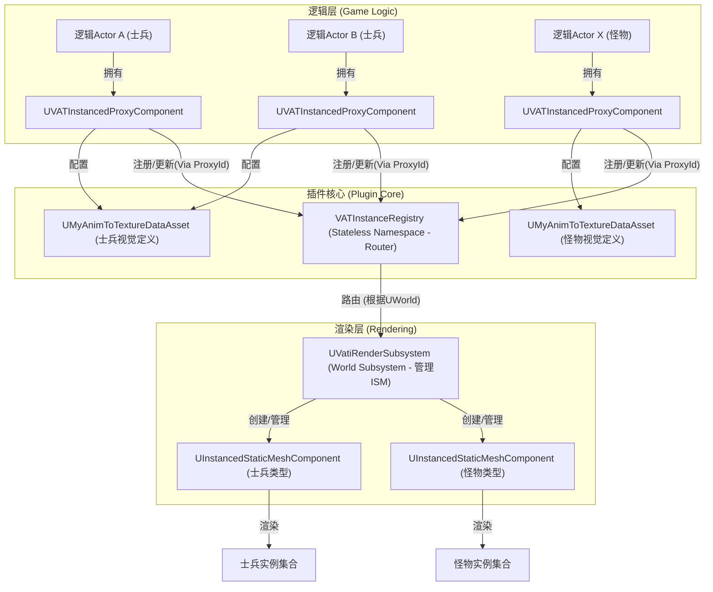

---

**VAT Instanced Rendering Plugin: 功能特性与集成指南**

**目录**

1.  [引言：为什么选择 VAT 实例化渲染？](#1-引言为什么选择-vat-实例化渲染)
2.  [核心特性](#2-核心特性)
3.  [工作原理概览](#3-工作原理概览)
4.  [主要组件与概念](#4-主要组件与概念)
    *   [4.1 视觉定义资源 (`UMyAnimToTextureDataAsset`)](#41-视觉定义资源-umyanimtotexturedataasset)
    *   [4.2 逻辑 Actor 与视觉代理 (`UVATInstancedProxyComponent`)](#42-逻辑-actor-与视觉代理-uvatinstancedproxycomponent)
    *   [4.3 实例渲染器 (`UVatiRenderSubsystem`)](#43-实例渲染器-UVatiRenderSubsystem)
    *   [4.4 动画通知适配 (`IStaticMeshAnimNotifyInterface`)](#44-动画通知适配-istaticmeshanimnotifyinterface)
5.  [功能特性详解](#5-功能特性详解)
    *   [5.1 动态动画控制与状态切换](#51-动态动画控制与状态切换)
    *   [5.2 支持动画通知 (Anim Notifies)](#52-支持动画通知-anim-notifies)
    *   [5.3 支持OverlayMaterial](#53-支持OverlayMaterial)
6.  [集成与使用指南](#6-集成与使用指南)
    *   [6.1 资源准备](#61-资源准备)
    *   [6.2 材质要求](#62-材质要求)
    *   [6.3 动画播放与控制](#63-动画播放与控制)
    *   [6.4 逻辑 Actor 配置](#64-逻辑-actor-配置)
7.  [设计决策与考量](#7-设计决策与考量)
    *   [7.1 性能与可扩展性](#71-性能与可扩展性)
    *   [7.2 动画通知的实现](#72-动画通知的实现)
8.  [未来展望](#8-未来展望)

---

## 1. 引言：为什么选择 VAT 实例化渲染？

在密集人群场景中，基于 `USkeletalMeshComponent` 的角色因较多的动画蓝图计算以及绘制调用 (Draw Call)，会导致帧率下降。顶点动画纹理 (VAT) 技术通过将动画（骨骼动画与蒙皮权重）烘焙到纹理中，在静态网格体 (`UStaticMeshComponent`) 上通过Shader播放动画，减轻了 CPU 的动画计算负担。而实例化渲染机制则能够合并静态网格体的Draw Call。

## 2. 核心特性

*   **逻辑与视觉分离：** 角色Actor只保留（AI、行为树、碰撞、游戏逻辑等），不再拥有网格体。其视觉表现则由本插件系统统一管理和渲染。
*   **动态动画控制：** 运行时为每个实例独立切换和播放不同的 VAT 动画片段。
*   **动画平滑过渡：** 支持动画之间的混合 (Blending)，使得动画切换更加自然。
*   **动画通知支持：** 兼容动画通知 (Anim Notify) 机制，允许在 VAT 动画播放到特定时间点时触发游戏逻辑（如脚步声、特效、攻击判定等）。

## 3. 工作原理概览

将具有相同视觉资产（即相同的静态网格体和 VAT 动画纹理集）但行为独立的多个逻辑 Actor 的视觉表现，合并到单个`UInstancedStaticMeshComponent` (ISM) 中进行渲染。

1.  **视觉定义：** 使用仿照官方 `UAnimToTextureDataAsset` 的自定义类 (`UMyAnimToTextureDataAsset`) 来定义一种“视觉类型”。该资源不仅包含由 生成的静态网格体、VAT 纹理和动画片段信息，还额外定义了该视觉类型与实例化系统交互时所需的自定义数据格式（如在 Per-Instance Custom Data 中的偏移量和所需浮点数数量）。
2.  **逻辑注册：** 每个需要被实例化渲染的逻辑Actor需附加一个 `UVATInstancedProxyComponent`。此组件负责：
    *   指定其所使用的 `UMyAnimToTextureDataAsset`（视觉类型）。
    *   在 `OnRegister` 时向全局的 `VATInstanceRegistry` 注册该逻辑 Actor 及其视觉需求。
    *   管理当前逻辑 Actor 的动画状态（如当前播放的动画、目标动画、混合状态等）。
    *   在 `Tick` 中更新动画时间，计算驱动 VAT 动画所需的参数（如当前帧、混合动画的帧和 alpha 值）。
    *   将更新后的变换和动画参数通过 `VATInstanceRegistry` 通知给渲染层。
3.  **中央调度与渲染：**
    *   `UVatiRenderSubsystem` 是一个 `UWorldSubsystem`，它会自动为每个游戏世界创建一个实例，无需手动放置。它实现了渲染器接口，并从 `VATInstanceRegistry` 接收指令。
    *   `VATInstanceRegistry` 是一个 C++ `namespace`，充当代理组件和渲染器之间的**无状态**桥梁。它根据组件的 `UWorld` 将调用路由到正确的 `UVatiRenderSubsystem` 实例。
    *   `UVatiRenderSubsystem` 根据注册的 `UMyAnimToTextureDataAsset` 类型，为每种类型创建一个对应的 `UInstancedStaticMeshComponent` (或 HISM)。
    *   它维护逻辑 Actor 的 `ProxyId` 到其在 ISM 中对应实例索引 (InstanceIndex) 的映射，以及空闲实例索引池。
    *   当逻辑 Actor 注册、注销或更新视觉状态时，`UVatiRenderSubsystem` 会在其管理的 ISM 组件上添加、移除（逻辑隐藏并回收索引）或更新实例的变换 (Transform) 和 Per-Instance Custom Data。这些 Custom Data 会被传递给材质，用于驱动 VAT 动画（如采样正确的纹理帧、处理动画混合等）。
4.  **动画通知：**
    *   `UVATInstancedProxyComponent` 在运行时根据当前播放的动画时间和原始 `UAnimSequence` 中的通知信息，动态查询并触发动画通知。
    *   为此，插件引入了 `IVertexAnimationNotifyInterface`。希望在 VAT 动画中响应通知的 `UAnimNotify` 或 `UAnimNotifyState` 类需要实现此接口。当代理组件检测到通知触发时，会调用该接口的相应方法。

## 4. 主要组件与概念

### 4.1 视觉定义资源 (`UMyAnimToTextureDataAsset`)

*   **类型：** 仿照UE5.5 `AnimToTexture` 插件的 `UAnimToTextureDataAsset`。
*   **职责：**
    *   封装一种视觉类型所需的所有静态数据，包括：
        *   要使用的 `UStaticMesh`。
        *   VAT 相关的纹理 (`VertexPositionTexture`, `BonePositionTexture`, 等)。
        *   原始动画序列信息 (`FAnimSequenceInfo` 数组) 及烘焙后的动画片段信息 (`FAnimInfo` 数组)。
    *   **新增配置：**
        *   `CustomDataStartOffset`: 此视觉类型的 VAT 数据在 `UInstancedStaticMeshComponent` 的 Per-Instance Custom Data 数组中的起始索引。
        *   `NumCustomDataFloatsForVAT`: 此视觉类型的 VAT 动画（包括可能的混合）需要使用的浮点数数量。
*   **重要性：** 这是定义“一类”可实例化对象的视觉基础。不同的 `UMyAnimToTextureDataAsset` 实例代表不同的角色模型或动画集。

### 4.2 逻辑 Actor 与视觉代理 (`UVATInstancedProxyComponent`)

*   **类型：** `UActorComponent`。
*   **职责：**
    *   附加到游戏世界中的逻辑 `AActor` 上（如 AI 控制的角色）。
    *   **配置：** 引用一个 `UMyAnimToTextureDataAsset` 来定义其宿主 Actor 的视觉外观和可用动画。
    *   **动画状态管理：** 内部维护当前播放的主动画 (`PrimaryAnimState`) 和用于混合的次动画 (`SecondaryAnimState`) 的状态，包括当前动画索引、播放时间、目标下一动画、混合参数（alpha、时长）等。
    *   **注册与通信：** 在 `OnRegister` 时向 `VATInstanceRegistry` 注册，在 `OnUnregister` 时注销。在 `TickComponent` 中：
        *   更新内部动画状态（推进时间、处理混合、检测动画结束并根据配置转换到下一动画）。
        *   计算当前帧需要传递给材质的自定义数据 (一个 `TArray<float>`)。
        *   通过 `VATInstanceRegistry` 将宿主 Actor 的最新世界变换和计算好的自定义数据通知给 `UVatiRenderSubsystem`。
    *   **动画控制接口：** 提供蓝图可调用的函数如 `PlayNamedTexturedAnim(AnimName, ...)` 来控制动画播放和过渡。
    *   **动画通知处理：** 在 `TickComponent` 中，根据当前播放的动画时间和原始 `UAnimSequence` 中的通知数据，调用 `UAnimSequenceBase::GetAnimNotifies` 来检测是否有通知事件在该帧触发。如果检测到，并且该通知的 `UAnimNotify` 对象实现了 `IVertexAnimationNotifyInterface`，则调用该接口的 `VertexAnimationNotify` 方法。

### 4.3 实例渲染器 (`UVatiRenderSubsystem`)

*   **类型：** `UWorldSubsystem`。
*   **职责：**
    *   作为游戏世界中实例化渲染的执行者和管理者，自动随世界创建和销毁。
    *   实现 `IVATInstanceRendererInterface` 接口，响应来自 `VATInstanceRegistry` 的调用。
    *   **ISM 管理：**
        *   为每个激活的 `FBatchKey`（视觉类型，由网格体和材质构成）动态创建并持有一个 `UInstancedStaticMeshComponent`。
        *   根据 `UMyAnimToTextureDataAsset` 中的配置设置对应 ISM 的 `NumCustomDataFloats` 属性，确保有足够的空间存储所有类型的自定义数据。
    *   **实例生命周期管理：**
        *   维护从 `FVATProxyId` 到其在对应 ISM 中的 `InstanceIndex` 的映射 (`InstanceInfos`)。
        *   为每个 ISM 维护一个空闲 `InstanceIndex` 列表以实现实例复用。
        *   当代理注册时，从空闲列表获取或通过 `AddInstance` 创建新实例，并更新其初始变换和自定义数据。
        *   当代理注销时，将其对应的实例变换设置为“不可见”（例如，缩放到极小或移到远处），并将其 `InstanceIndex` 回收到空闲列表。**避免直接调用 `RemoveInstance`，以防打乱索引。**
    *   **实例数据更新：** 响应 `UpdateProxyVisuals` 调用，根据 `FVATProxyId` 找到对应的 ISM 和 `InstanceIndex`，然后调用 `UpdateInstanceTransform` 和 `SetCustomDataValue` (或 `SetCustomData`) 来更新实例的视觉状态。

### 4.4 动画通知适配 (`IVertexAnimationNotifyInterface`)

*   **类型：** C++ 接口类 (`UInterface`)。
*   **职责：**
    *   定义一个契约，允许原始的 `UAnimNotify` 或 `UAnimNotifyState` 类能够响应由 `UVATInstancedProxyComponent` 模拟触发的通知事件。
    *   **核心方法：** `VertexAnimationNotify(UVATInstancedProxyComponent* Proxy)`。
*   **工作流程：**
    1.  希望在 VAT 动画中使用的 `UAnimNotify` 类需要继承此接口并实现 `VertexAnimationNotify`。
    2.  `UVATInstancedProxyComponent` 在运行时检测到某个原始通知应被触发时，会获取该通知的默认对象 (CDO)。
    3.  如果该 CDO 实现了 `IVertexAnimationNotifyInterface`，则调用其 `VertexAnimationNotify` 方法，传递代理组件自身的指针作为上下文。
    4.  接口的实现者可以在此方法内执行其原有的通知逻辑，例如通过 `Proxy->GetOwner()` 获取逻辑 Actor 来播放声音、生成特效等。

## 5. 功能特性详解

### 5.1 动态动画控制与状态切换

每个逻辑 Actor 通过其 `UVATInstancedProxyComponent` 可以独立控制其动画状态。
*   `PlayTexturedAnim` 函数允许指定要播放的动画片段索引（对应 `UMyAnimToTextureDataAsset` 中 `Animations` 数组的索引）。
*   通过 `NextAnimIndexOnEnd` 参数，可以构建简单的状态转换：当一个动画播放完毕后，自动转换到指定的下一个动画。例如，攻击动画播放完毕后自动转换到待机动画，或者行走动画结束时继续播放行走动画以实现循环。

### 5.2 支持动画通知 (Anim Notifies)

尽管没有动画蓝图，本插件提供了一种机制来模拟和响应原始动画中的通知事件。
*   **原理：** `UVATInstancedProxyComponent` 在每一帧根据当前动画的播放时间 (`AnimTime`) 和原始 `UAnimSequence` (通过 `VisualTypeAsset->AnimSequences` 访问)，使用 `UAnimSequenceBase::GetAnimNotifies` 查询在该时间小窗内是否有通知事件触发。
*   **接口适配：** 原始的 `UAnimNotify` 或 `UAnimNotifyState` 类如果希望在 VAT 系统中被触发，需要实现 `IVertexAnimationNotifyInterface` 接口及其 `VertexAnimationNotify` 方法。
*   **触发：** 当检测到通知时，代理组件会获取通知对象，检查其是否实现了上述接口，如果是，则调用接口方法，将代理组件自身等上下文信息传递过去。通知的实现者可以据此执行相应的游戏逻辑。
*   **优点：** 方便的让已有的Notify不仅支持Skeletonmesh，还支持StaticMesh。`Received_Notify`和`Received_StaticMeshNotify`的逻辑一般比较相似，复制后微调即可。

### 5.3 支持OverlayMaterial

`UVATInstancedProxyComponent::SetOverlayMaterial` 会为ISMC赋予OverlayMaterial, 并进行计数。当需要OverlayMaterial的Instance计数归零时ISMC的OverlayMaterial也会取消。

## 6. 集成与使用指南

### 6.1 资源准备

1.  **使用EUW_VAT_Utils创建相关资源：**
    *   EUW_VAT_Utils在插件的Content目录下，它会调用蓝图函数完成以下资源的创建：
        *   将用户指定的`SkeletalMesh`转换为`StaticMesh`。
        *   用户指定动画序列。按此创建`UMyAnimToTextureDataAsset`并填充部分参数。部分情况下用户需要手动继续修改。
        *   将动画烘焙为texture，并且修改`StaticMesh`的Material中的LayerParameter。

### 6.2 材质要求

用于渲染 VAT 实例的材质至关重要。
*   它必须能够从 Per-Instance Custom Data 中读取动画参数。
*   读取的起始索引和浮点数数量必须与 `UMyAnimToTextureDataAsset` 中的 `CustomDataStartOffset` 和 `NumCustomDataFloatsForVAT` 配置一致。
*   **简单播放 (1 float):** 从 `CustomData[Offset]` 读取绝对帧号，用于 VAT 纹理采样。
*   **混合播放 (3 floats):**
    *   从 `CustomData[Offset+0]` 读取 FrameA (主目标动画的当前绝对帧号)。
    *   从 `CustomData[Offset+1]` 读取 FrameB (前一个动画的绝对帧号，在混合开始时固定)。
    *   从 `CustomData[Offset+2]` 读取 BlendAlpha (0.0 到 1.0 的混合权重)。
    *   材质需要在顶点着色器中对使用 FrameA 和 FrameB 分别采样VAT纹理得到的位置/法线等数据，然后根据 BlendAlpha 进行线性插值。
*   材质还需要 `UAnimToTextureDataAsset` 中的其他信息作为参数（通常通过材质实例设置），如 `RowsPerFrame`, `NumFrames` (总帧数), `BoundingBoxMin`, `BoundingBoxScale` 等。

### 6.3 动画播放与控制

在逻辑 Actor 的蓝图或 C++ 代码中，获取其 `UVATInstancedProxyComponent` 的引用，然后调用：
*   `PlayNamedTexturedAnim(AnimName, bTransitionToNextOnEnd, NextAnimNameOnEnd, BlendTime)`:
    *   `AnimName`: 要播放的动画在 `UMyAnimToTextureDataAsset::AnimSequences` 数组中的名称。
    *   `bTransitionToNextOnEnd`: (可选) 此动画播放完毕后是否自动转换。
    *   `NextAnimNameOnEnd`: (可选) 如果自动转换，下一个动画的名称。
    *   `BlendTime`: (可选) 与上一个动画混合（如果正在播放）或开始向下一个动画混合（如果配置了 `NextAnimNameOnEnd`）的过渡时间。

### 6.4 逻辑 Actor 配置

1.  对于需要进行实例化渲染的逻辑 Actor (例如 AI 角色蓝图)：
    *   添加 `UVATInstancedProxyComponent` 组件。
    *   在该组件的细节面板中，将其 `VisualTypeAsset` 属性设置为之前创建和配置好的 `UMyAnimToTextureDataAsset` 实例。

## 7. 设计决策与考量

### 7.1 性能与可扩展性

*   **HISM 支持：** 通过修改 `UVatiRenderSubsystem` 的代码，可以轻松切换到 `UHierarchicalInstancedStaticMeshComponent`，以利用其更好的剔除和 LOD 支持（前提是 `UStaticMesh` 本身配置了 LOD）。

### 7.2 动画通知的实现

*   **运行时查询 vs. 预烘焙：** 最初考虑过将通知信息（如触发的VAT绝对帧号）也预烘焙到 `UMyAnimToTextureDataAsset` 中。这样做可以在运行时进行更快的查找。然而，为了简化美术和策划的工作流程（他们只需像平常一样在 `UAnimSequence` 中放置通知），并减少数据冗余和潜在的同步问题，最终选择了在 `UVATInstancedProxyComponent` 中**运行时查询**。
*   **`UAnimSequenceBase::GetAnimNotifies`：** 该引擎函数能在给定时间段内返回活跃的通知，是运行时查询的核心。代理组件在每帧根据当前动画的播放进度和 `DeltaTime` 来调用此函数。
*   **接口适配：** `IVertexAnimationNotifyInterface` 的引入是为了让现有的 `UAnimNotify` 体系能够以一种相对非侵入的方式与VAT系统集成。通知的逻辑仍然在原始的 `UAnimNotify` 类中，只是其触发点由骨骼网格系统变为了VAT代理组件。

## 8. 未来展望

*   **更复杂的动画状态机：** 当前的 `PlayTexturedAnim` 和 `NextAnimIndexOnEnd` 提供了基础的状态转换。未来可以考虑在 `UVATInstancedProxyComponent` 中实现更完整的状态机逻辑，支持更复杂的条件转换、动画层等。（比如依靠StateTree）
*   **自定义InstancedStaticMeshComponent：** 在UE5.3等后续版本中，有RemoveAtSwap等优化。可以考虑自定义来为之前版本的引擎服务。
---
